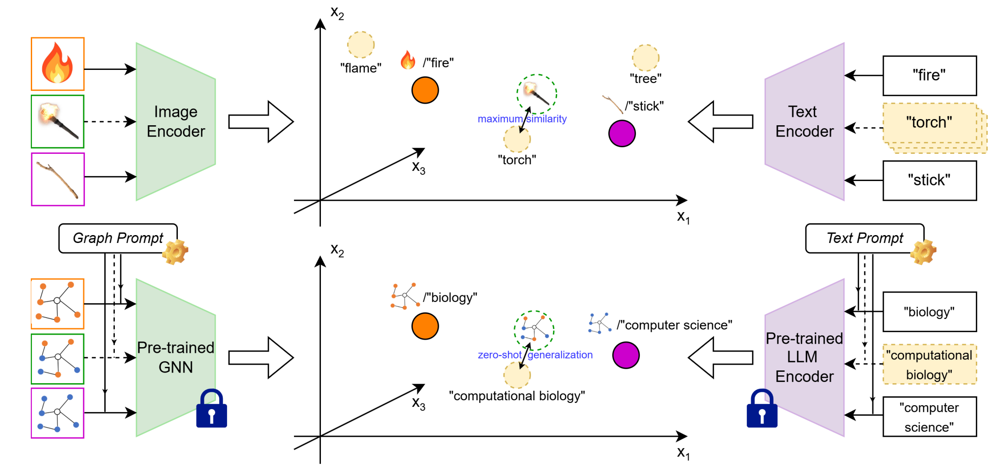

# Morpher
[ACL 2025 Main] https://arxiv.org/abs/2412.08174

**[Paper (ACL Anthology)](https://aclanthology.org/2025.acl-long.545/)** | **[Paper (arXiv version)](./Morpher_ACL_2025_main.pdf)** | **[Poster](./ACL_2025_main_Poster.pdf)**

------------------------

Figure: CLIP backbone (top) and this work (bottom). If a research paper cites many papers from biology and computer science, we realize this paper will likely be about computational biology, even if we do not know what exactly computational biology is. This work leverages Multi-modal Prompt Learning for Graph Neural Networks that can effectively teach GNNs language dependency given few training samples with weak text supervision.

------------------------
## How to Use
The "code" folder contains the source code for reproducing our experiments.


## Cite
If you find this repository useful in your research, please consider citing the following paper:
```
@inproceedings{DBLP:conf/acl/0006ZJFJBH025,
  author       = {Zihao Li and
                  Lecheng Zheng and
                  Bowen Jin and
                  Dongqi Fu and
                  Baoyu Jing and
                  Yikun Ban and
                  Jingrui He and
                  Jiawei Han},
  editor       = {Wanxiang Che and
                  Joyce Nabende and
                  Ekaterina Shutova and
                  Mohammad Taher Pilehvar},
  title        = {Can Graph Neural Networks Learn Language with Extremely Weak Text
                  Supervision?},
  booktitle    = {Proceedings of the 63rd Annual Meeting of the Association for Computational
                  Linguistics (Volume 1: Long Papers), {ACL} 2025, Vienna, Austria,
                  July 27 - August 1, 2025},
  pages        = {11138--11165},
  publisher    = {Association for Computational Linguistics},
  year         = {2025},
  url          = {https://aclanthology.org/2025.acl-long.545/},
  timestamp    = {Thu, 24 Jul 2025 21:25:39 +0200},
  biburl       = {https://dblp.org/rec/conf/acl/0006ZJFJBH025.bib},
  bibsource    = {dblp computer science bibliography, https://dblp.org}
}
```